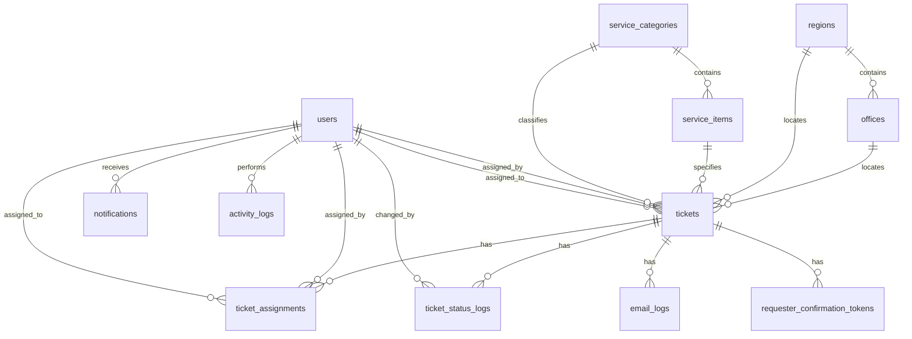

# Database Design

## Overview

The application uses a MySQL database named `ictts` with UTF-8 MB4 collation. The base schema is in `database/schema.sql`; additional SQL files in `database/` capture incremental changes such as notifications, location updates, pending status, and the current status flow.

The schema is organized around:

- Staff users and roles.
- Service and location libraries.
- Tickets and workflow history.
- Notifications.
- Email and activity audit logs.
- Requester confirmation tokens.
- Runtime settings.

## Entity Relationship Summary

## Core Tables

### `users`

Stores authenticated staff accounts.

Key columns:

- `id`: primary key.
- `id_number`: unique employee or staff identifier.
- `name`, `position`, `email`.
- `password_hash`: password generated by PHP `password_hash()`.
- `role`: `technical`, `unit_head`, `division_chief`, or `admin`.
- `status`: `active` or `inactive`.
- `last_login_at`, `created_at`, `updated_at`.

Important constraints:

- Unique `id_number`.
- Unique `email`.

### `tickets`

Stores the current state and request details for each ICT service ticket.

Key columns:

- `ticket_no`: unique public ticket number.
- `requested_at`: actual submission timestamp.
- `requester_name`, `requester_position`, `requester_email`, `requester_contact`.
- `region_id`, `office_id`: requester's office location.
- `requested_for`: requested service date/time.
- `service_category_id`, `service_item_id`: requested service classification.
- `description`: requester concern/details.
- `priority`: severity copied from the selected specific request when the ticket is submitted.
- `status`: current workflow state.
- `assigned_to`, `assigned_by`, `assigned_at`.
- `completed_by_tech_at`, `requester_confirmed_at`, `closed_at`.
- `created_at`, `updated_at`.

Important indexes:

- `tickets_status_idx`
- `tickets_requested_at_idx`
- `tickets_assigned_to_idx`

Important foreign keys:

- `region_id -> regions.id`
- `office_id -> offices.id`
- `service_category_id -> service_categories.id`
- `service_item_id -> service_items.id`
- `assigned_to -> users.id`
- `assigned_by -> users.id`

### `ticket_assignments`

Stores assignment history for tickets.

Key columns:

- `ticket_id`
- `assigned_to`
- `assigned_by`
- `assigned_at`
- `notes`

The row is deleted automatically when its ticket is deleted because the foreign key uses `ON DELETE CASCADE`.

### `ticket_status_logs`

Stores status transition history.

Key columns:

- `ticket_id`
- `old_status`
- `new_status`
- `changed_by`
- `changed_by_name`
- `remarks`
- `created_at`

This table is the audit trail for lifecycle movement. Public requester actions use `changed_by_name` when no authenticated `users.id` exists.

## Library Tables

### `service_categories`

Defines high-level ICT service categories.

Current seed examples:

- Hardware and Network Infrastructure
- Systems and Application

### `service_items`

Defines requestable services under a category.

Key columns:

- `default_priority`: default severity/SLA driver applied when this specific request is selected.

Important constraints:

- Unique `service_item_unique (service_category_id, name)`.
- Foreign key to `service_categories`.

### `regions`

Defines NFA regions and central office groupings.

Important constraints:

- Unique `code`.

### `offices`

Defines offices under each region.

Important constraints:

- Unique `office_unique (region_id, name)`.
- `office_type` enum: `Regional Office`, `Branch Office`, `Central Office`, `District Office`, `Other`.

Library records use `status = active/inactive`; application delete operations inactivate records instead of deleting them.

## Communication and Audit Tables

### `notifications`

Stores in-app notifications for staff users.

Key columns:

- `user_id`
- `title`
- `message`
- `link`
- `read_at`
- `created_at`

Indexes:

- `notifications_user_read_idx (user_id, read_at)`
- `notifications_created_idx (created_at)`

### `email_logs`

Stores all outbound email attempts.

Key columns:

- `ticket_id`
- `recipient_email`
- `subject`
- `body`
- `status`: `queued`, `sent`, `failed`, or `logged`.
- `error_message`
- `created_at`

The application currently sends immediately and records the result. `queued` is present in the enum for future queue support.

### `activity_logs`

Stores user and public-requester activity.

Key columns:

- `user_id`
- `actor_name`
- `action`
- `entity_type`
- `entity_id`
- `details`
- `ip_address`
- `created_at`

Indexes:

- `activity_action_idx`
- `activity_created_idx`

### `requester_confirmation_tokens`

Stores hashed public confirmation links for completed tickets.

Key columns:

- `ticket_id`
- `token_hash`: SHA-256 hash of the emailed token.
- `expires_at`: currently 14 days after token creation.
- `used_at`
- `created_at`

Important constraints:

- Unique `token_hash`.
- Cascade delete with ticket.

### `settings`

Stores configurable key/value settings.

Current seed values:

- `ict_notification_email`
- `system_public_url`

The current application also relies on constants in `config/config.php`; `settings` is available for future database-backed configuration.

## Seed Data

The base schema inserts:

- Four temporary users: technical personnel, unit head, division chief, and admin.
- Two service categories and initial service items.
- Region and office libraries.
- Initial system settings.

Temporary seeded accounts use the same password in `database/schema.sql`: `TempPass123`. Production deployments should rotate or disable these credentials immediately after migration validation.

## Migration Notes

Existing SQL update files:

- `add_pending_status.sql`: adds or migrates pending status support.
- `add_notifications.sql`: adds notification support.
- `update_locations.sql`: updates location library data.
- `update_status_flow.sql`: maps older statuses into the current lifecycle and updates the ticket status enum.

For future changes:

- Prefer additive migration files instead of editing production-applied SQL.
- Keep enum changes synchronized between `database/schema.sql`, migration SQL, and `Ticket::STATUSES`.
- Add indexes before introducing high-volume report filters.
- Preserve audit rows when changing lifecycle behavior.
