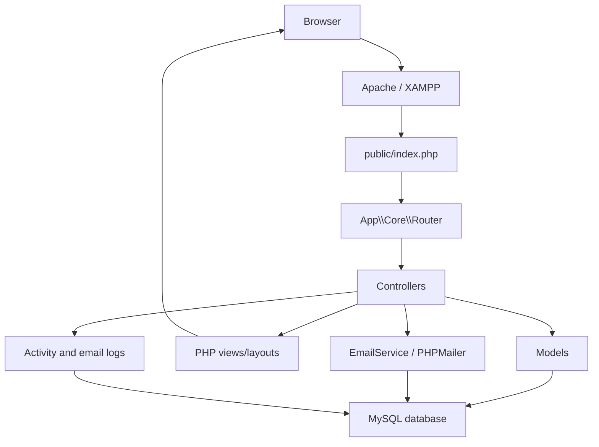

# System Design

## Purpose

The ICTSD Ticketing System supports the National Food Authority ICTSD service request process. It provides a public request form, authenticated staff workspace, ticket assignment, status tracking, requester completion confirmation, reporting, notifications, and audit logs.

## Technology Stack

| Layer | Technology | Notes |
| --- | --- | --- |
| Runtime | PHP 8.1+ | Custom MVC structure with strict types. |
| Web server | Apache/XAMPP | Public entry point is `public/index.php`. |
| Database | MySQL/MariaDB | Schema is defined in `database/schema.sql`. |
| Frontend | Server-rendered PHP views, Bootstrap, custom CSS/JS | Views live under `app/Views`. |
| Email | PHPMailer, SMTP or PHP `mail()` fallback | Email attempts are persisted in `email_logs`. |
| Session/auth | PHP sessions | Authenticated user context is stored in `$_SESSION['user']`. |

## Application Structure

```text
ICTTS/
  app/
    Controllers/   HTTP request handlers
    Core/          Router, controller base, database, auth, CSRF, helpers
    Models/        Database access and domain operations
    Services/      Email and activity logging
    Views/         Layouts and page templates
  config/          Runtime constants and database/email settings
  database/        Base schema and incremental SQL updates
  public/          Web root, assets, front controller
  docs/            Technical documentation
```

## Runtime Architecture



Request handling starts in `public/index.php`, which loads configuration, helpers, and the PSR-style autoloader for `App\` classes. The router normalizes the URL against `BASE_URL`, matches the HTTP method and path, and invokes the mapped controller method.

## Main Modules

### Public Request Module

Controller: `App\Controllers\PublicController`

Responsibilities:

- Render the public request form.
- Load active service categories, service items, regions, and offices.
- Validate requester input and dependent dropdown selections.
- Create tickets with initial status `Submitted`.
- Email the requester and ICT notification address.
- Notify supervisors about new submissions.
- Handle requester completion confirmation through a tokenized link.

### Ticket Management Module

Controller: `App\Controllers\TicketController`

Responsibilities:

- List tickets with filters.
- Display ticket details, assignment history, and status logs.
- Assign tickets to technical personnel.
- Allow assigned technical personnel to update status.
- Generate requester confirmation tokens when a ticket is marked `Completed`.

### Dashboard and Reports

Controllers: `DashboardController`, `ReportController`

Responsibilities:

- Show aggregate ticket counts by status.
- Show breakdowns by service category, region, and assignee.
- Provide filtered ticket lists for report review.

### Library Management

Controller: `LibraryController`

Responsibilities:

- Maintain service categories and service items.
- Maintain regions and offices.
- Soft-delete library records by setting `status = inactive`.
- Restrict all library changes to admins.

### User Management

Controller: `UserController`

Responsibilities:

- Maintain staff accounts.
- Manage role and account status.
- Allow users to update their own profiles.
- Hash passwords using PHP `password_hash()`.

### Notifications and Logs

Controllers: `NotificationController`, `LogController`

Responsibilities:

- Store and display in-app notifications for staff.
- Mark notifications as read.
- Record user and public requester activity.
- Record outbound email attempts and delivery status.

## Route Groups

| Area | Routes | Access |
| --- | --- | --- |
| Public request | `GET/POST /request` | Public |
| Public confirmation | `GET/POST /confirm/{token}` | Public with valid token |
| Public APIs | `GET /api/offices`, `GET /api/services` | Public |
| Authentication | `/login`, `/register`, `/logout` | Mixed |
| Dashboard | `/dashboard` | Authenticated users |
| Tickets | `/tickets`, `/tickets/{id}`, assignment/status posts | Authenticated users with role-specific controls |
| Libraries | `/libraries/services`, `/libraries/locations` | Admin |
| Users | `/users`, `/profile` | User/admin controls |
| Reports | `/reports` | Authenticated users |
| Logs | `/logs` | Admin |

## Integration Points

### Email

`EmailService` sends transactional messages for:

- Ticket submission acknowledgment to requester.
- New ticket notification to ICT.
- Assignment notice to technician.
- Assignment notice to requester.
- Completion confirmation link to requester.
- Requester confirmation notice to supervisors and assignee.

Every send attempt is logged to `email_logs`, including failures.

### In-App Notifications

`Notification` records are created for:

- Supervisors when a new ticket is submitted.
- Assigned technician when a ticket is assigned.
- Supervisors when ticket status changes.
- Supervisors and assigned technician when requester confirms completion.

## Deployment Assumptions

- The web server points users to `public/index.php`.
- `BASE_URL` matches the deployed path and `APP_PUBLIC_URL` matches the deployed HTTPS domain, for example `https://ebps.nfa.gov.ph/ICTTS/public`.
- `database/schema.sql` has been imported into MySQL.
- SMTP constants in `config/config.php` are valid for the deployment environment.
- PHP sessions are available and configured securely by the web server.

## Non-Functional Design Notes

- The application uses prepared PDO statements for database access.
- Ticket and email events are audit-friendly through status logs, activity logs, and email logs.
- Library records are inactivated rather than physically deleted.
- The current routing layer is intentionally simple and centralized in `App\Core\Router`.
- Business rules live mostly in models and controllers rather than a separate domain service layer.
