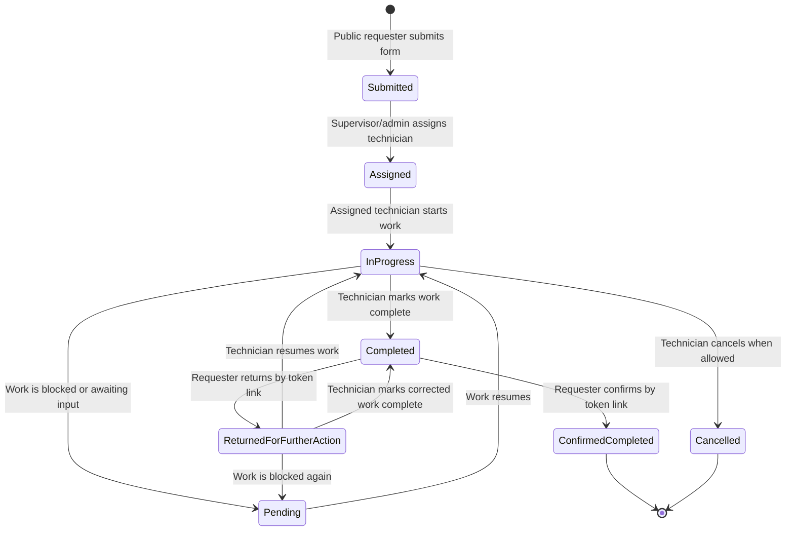

# Workflow and Status Controls

## Roles

| Role | Main Responsibilities |
| --- | --- |
| Public requester | Submit ICT service requests and confirm completion through the emailed confirmation link. |
| Technical personnel | Work assigned tickets and update status for tickets assigned to them. |
| Unit head | Monitor tickets, assign tickets, receive notifications, and review progress. |
| Division chief | Monitor tickets, assign tickets, receive notifications, and review progress. |
| Admin | Manage all staff-facing controls, users, libraries, logs, assignment, and reporting. |

## Ticket Lifecycle

Database status values:

- `Submitted`
- `Assigned`
- `In Progress`
- `Pending`
- `Completed`
- `Confirmed Completed`
- `Returned for Further Action`
- `Cancelled`

## Workflow Details

### 1. Request Submission

Actor: public requester

System behavior:

- Validates required requester fields, email format, contact number format, description length, selected region/office pair, selected category/service pair, and requested schedule.
- Creates a ticket with generated number format `ICTSD-YYYYMMDD-XXXXXX`.
- Sets initial status to `Submitted`.
- Writes a `ticket_status_logs` entry.
- Writes an `activity_logs` entry with the public requester name.
- Sends a requester acknowledgment email.
- Sends an ICT notification email.
- Creates in-app notifications for supervisor roles.

### 2. Assignment

Actors: admin, unit head, division chief, or non-manager account assigning the ticket to self through the controller path.

System behavior:

- Blocks assignment if the ticket already has an assignee.
- Sets `assigned_to`, `assigned_by`, `assigned_at`, and status `Assigned`.
- Inserts a row in `ticket_assignments`.
- Inserts a `ticket_status_logs` row from the old status to `Assigned`.
- Sends an assignment email to the technician.
- Sends an assignment email to the requester.
- Creates an in-app notification for the assigned technician.
- Writes an activity log.

### 3. Technical Status Updates

Actor: assigned technical personnel

Controls:

- Only users with role `technical` can update ticket status through the technical status flow.
- The technical user must be the assigned technician for the ticket.
- Available statuses are calculated by `Ticket::availableTechnicalStatuses()`.
- Status choices are constrained to `In Progress`, `Pending`, `Completed`, and conditionally `Cancelled`.

System behavior:

- Updates the current ticket status.
- Sets `completed_by_tech_at` when status becomes `Completed`.
- Logs the status change with optional remarks.
- Notifies supervisor roles.
- When status becomes `Completed`, creates a 14-day requester confirmation token and sends the confirmation email.

### 4. Requester Confirmation

Actor: public requester with valid confirmation token

Controls:

- Token is stored as a SHA-256 hash.
- Token must be unused.
- Token must not be expired.
- Token is marked used during confirmation.

System behavior:

- Sets ticket status to `Confirmed Completed`.
- Sets `requester_confirmed_at`.
- Logs the status change as performed by `Public Requester`.
- Writes an activity log.
- Emails supervisors and the assigned technician.
- Creates in-app notifications for supervisors and the assigned technician.

## Status Control Matrix

| Current Status | Allowed Next Status | Actor | Notes |
| --- | --- | --- | --- |
| None | `Submitted` | Public requester | Created by public request form. |
| `Submitted` | `Assigned` | Admin, unit head, division chief, eligible assigner | Assignment is blocked when `assigned_to` is already set. |
| `Assigned` | `In Progress` | Assigned technical personnel | First technical progress update. |
| `Assigned` | `Pending` | Assigned technical personnel | Allowed by the computed technical status list when work is immediately blocked. |
| `In Progress` | `Pending` | Assigned technical personnel | Used when work is awaiting input, parts, schedule, access, or another dependency. |
| `Pending` | `In Progress` | Assigned technical personnel | Used when work resumes. |
| `In Progress` | `Completed` | Assigned technical personnel | Triggers requester confirmation email. |
| `Assigned` | `Completed` | Assigned technical personnel | Allowed if available in the computed technical status list. |
| `In Progress` | `Cancelled` | Assigned technical personnel | Available from `In Progress` before the ticket reaches a terminal status. |
| `Completed` | `Confirmed Completed` | Public requester | Requires valid token. |
| `Completed` | `Returned for Further Action` | Public requester | Requires valid token and requester marks the work unresolved. |
| `Returned for Further Action` | `In Progress` | Assigned technical personnel | Used when technical staff resumes returned work. |
| `Returned for Further Action` | `Pending` | Assigned technical personnel | Used when returned work is blocked again. |
| `Returned for Further Action` | `Completed` | Assigned technical personnel | Used when returned work can be corrected and completed directly. |

## Important Implementation Rules

- `Ticket::STATUSES` is the canonical application list for status filter options.
- `tickets.status` is the canonical current state.
- `ticket_status_logs` is the historical status audit trail.
- `ticket_assignments` is the assignment history.
- `availableTechnicalStatuses()` returns valid next statuses from the ticket's current state, so reopened or requester-returned work can move through another technical cycle.
- Supervisory notifications are sent to active users with roles `unit_head`, `division_chief`, and `admin`.

## Notifications by Event

| Event | Email Recipient | In-App Recipient |
| --- | --- | --- |
| Ticket submitted | Requester and ICT notification email | Supervisors |
| Ticket assigned | Assigned technician and requester | Assigned technician |
| Status updated | Requester only when status is `Completed`; otherwise email is not sent | Supervisors |
| Requester confirms completion | Supervisors and assigned technician | Supervisors and assigned technician |

## Operational Status Meanings

| Status | Meaning |
| --- | --- |
| `Submitted` | Request was received but not yet assigned. |
| `Assigned` | A technical personnel has responsibility for the ticket. |
| `In Progress` | Technical work has started or resumed. |
| `Pending` | Work is temporarily blocked or awaiting input/action. |
| `Completed` | Technical personnel marked the work complete; requester confirmation is still pending. |
| `Confirmed Completed` | Requester confirmed completion through the public confirmation link. |
| `Returned for Further Action` | Requester returned the ticket after technical completion because more work is needed. |
| `Cancelled` | Ticket work was cancelled before completion. |
